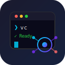

<p align="center">
  
</p>

<h1 align="center">VibeCoding</h1>

<p align="center">
  <strong>🚀 One Binary to Rule Them All — Your AI Coding Assistant in the Terminal</strong>
</p>

<p align="center">
  Stop switching between Claude Code, Codex, Claw, and Hermes.<br>
  VibeCoding packs everything into a single file — providers, tools, sandbox, sessions, skills, and more.
</p>

<p align="center">
  <a href="https://www.npmjs.com/package/vibecoding-installer"></a>
  <a href="https://pypi.org/project/vibecoding-installer/"></a>
  <a href="https://github.com/startvibecoding/vibecoding/releases/latest"></a>
  <a href="https://gitee.com/startvibecoding/vibecoding/releases/latest"></a>
  <a href="https://opensource.org/licenses/MIT"></a>
  <a href="https://goreportcard.com/report/github.com/startvibecoding/vibecoding"></a>
  <a href="https://pkg.go.dev/github.com/startvibecoding/vibecoding"></a>
  <a href="https://github.com/startvibecoding/vibecoding/network/dependencies"></a>
</p>

<p align="center">
  <strong>国内镜像: <a href="https://gitee.com/startvibecoding/vibecoding">Gitee</a></strong>
</p>

---

## ✨ Why VibeCoding?

**The Problem:** You're juggling multiple AI coding tools — Claude Code for one thing, Codex for another, Claw for something else. Each has its own setup, its own quirks, its own dependencies.

**The Solution:** VibeCoding is the **all-in-one terminal AI coding assistant** that does it all. One binary. One config. Zero hassle.

### 🎯 Key Highlights

| Feature | What It Means for You |
|---------|----------------------|
| **⚙️ Workflow Mode** | Dynamic Elisp workflows with phases, parallel execution, and multi-worker coordination — automate complex development pipelines |
| **🤖 Multi-Provider** | DeepSeek, OpenAI, Anthropic, Volcengine/Doubao, and 20+ vendor adapters — switch models instantly |
| **⚡ Lightning Fast** | SSE streaming, real-time token delivery, cache hit optimization |
| **🧠 Think Mode** | Extended reasoning for complex problems (DeepSeek, o1, Claude) |
| **🛡️ Sandboxed** | bwrap process isolation — safe file ops, network control, approval gates |
| **📝 Sessions** | Persistent SQLite-backed history with branching, compaction, and tree structure |
| **🧩 Skills** | Reusable prompt snippets for project conventions — share across teams |
| **💻 IDE Ready** | ACP protocol for VS Code, Zed, JetBrains — native editor integration |
| **🌐 Gateway** | OpenAI-compatible HTTP API — use VibeCoding as a backend service |
| **📱 Messaging** | WeChat, Feishu, WebSocket — deploy as a chatbot |
| **🤝 Multi-Agent** | Async sub-agents with `--multi-agent`, blocking delegation with `--delegate`, and A2A master mode |
| **🎨 Rich TUI** | Markdown rendering, syntax highlighting, thinking display, tool modals |
| **🔒 Security** | bashBlacklist > whitelist, YOLO mode safety, `--print` fails fast |

---

## 🚀 Get Started in 30 Seconds

```bash
# Install (pick one)
npm install -g vibecoding-installer          # npm (recommended)
pipx install vibecoding-installer           # PyPI
curl -fsSL https://raw.githubusercontent.com/startvibecoding/vibecoding/main/install.sh | bash  # Linux/macOS (GitHub)
curl -fsSL https://gitee.com/startvibecoding/vibecoding/raw/main/install.sh | bash  # Linux/macOS (Gitee 国内镜像)

# Set your API key
export DEEPSEEK_API_KEY=sk-...

# Run
vibecoding
```

That's it. You're coding with AI.

**Uninstall:**

```bash
# npm
npm uninstall -g vibecoding-installer

# PyPI
pipx uninstall vibecoding-installer

# Linux/macOS (one-line install)
curl -fsSL https://gitee.com/startvibecoding/vibecoding/raw/main/install.sh | bash -s -- --uninstall

# Windows (one-line install)
irm https://gitee.com/startvibecoding/vibecoding/raw/main/install.ps1 | iex; Uninstall-VibeCoding
```

---

## 🎮 Three Modes for Every Situation

```
🗒️  Plan    → Read-only analysis & planning. Safe, sandboxed, no surprises.
🔧  Agent   → Standard read/write. Bash approval required. (Default)
🚀  YOLO    → Full system access. No restrictions. For the brave.
```

Switch modes anytime with `/mode plan|agent|yolo` or press `Tab`.

---

## 🏗️ Architecture at a Glance

```
vibecoding/
├── cmd/vibecoding/        # CLI entry point
├── internal/
│   ├── agent/             # Core agent loop
│   ├── provider/          # LLM provider abstraction (20+ vendors)
│   ├── tools/             # Built-in tools (read, write, bash, grep, find, ...)
│   ├── sandbox/           # bwrap sandbox implementation
│   ├── session/           # SQLite session storage
│   ├── skills/            # Skills system
│   ├── tui/               # Terminal UI (BubbleTea + Lipgloss)
│   ├── gateway/           # OpenAI-compatible HTTP gateway
│   ├── hermes/            # Messaging gateway (WeChat/Feishu/WebSocket)
│   ├── a2a/               # A2A protocol server & master mode
│   └── acp/               # ACP / MCP integration
└── pkg/sdk/               # Public SDK interface
```

---

## 📚 Documentation

### 🚀 Getting Started
- [Quick Start](docs/en/getting-started.md) — Installation, configuration, first run
- [CLI Reference](docs/en/cli-reference.md) — All commands and flags

### ⚙️ Configuration
- [Configuration Guide](docs/en/configuration.md) — Settings, env vars, authentication

### 🏗️ Architecture
- [System Architecture](docs/en/architecture.md) — Core components, data flow
- [Tool System](docs/en/tools.md) — Built-in tools guide
- [Skills System](docs/en/skills.md) — Reusable prompt snippets
- [Online Skill Marketplace](docs/en/skillhub.md) — SkillHub / ClawHub integration

### 🔒 Security
- [Security & Sandbox](docs/en/security.md) — Sandbox modes, permissions, approval

### 💻 IDE Integration
- [ACP Protocol](docs/en/acp.md) — VS Code, Zed, JetBrains integration

### 🌐 Gateway Modes
- [Gateway Mode](docs/en/gateway.md) — OpenAI-compatible HTTP API
- [Hermes Mode](docs/en/hermes.md) — WeChat/Feishu/WebSocket chatbot
- [A2A Protocol](docs/en/a2a.md) — Agent-to-Agent protocol

### 📖 Tutorials
- [Scenarios & Walkthroughs](docs/en/scenarios.md) — Practical examples
- [FAQ](docs/en/faq.md) — Common questions answered

### 🇨🇳 中文文档
- [中文文档首页](docs/zh/README.md) — 完整中文文档

---

## 🎯 Use Cases

### 💻 Daily Development
```bash
vibecoding -P "Refactor this function to use generics"
vibecoding -P "Write tests for the UserService struct"
vibecoding -P "Explain what this regex does"
```

### 🔍 Code Review
```bash
vibecoding --mode plan "Review this PR and suggest improvements"
```

### 🚀 CI/CD Integration
```bash
vibecoding -p "Generate changelog from git log" > CHANGELOG.md
```

### 🌐 API Server
```bash
vibecoding gateway  # Start OpenAI-compatible HTTP server
```

### 📱 Chatbot
```bash
vibecoding hermes   # Deploy as WeChat/Feishu bot
```

---

## 🛠️ Built-in Tools

| Tool | Description |
|------|-------------|
| `read` | Read file contents |
| `write` | Create/overwrite files |
| `edit` | Precise text replacement |
| `bash` | Execute shell commands |
| `grep` | Search file contents (powered by ripgrep) |
| `find` | Find files by pattern (powered by fd) |
| `ls` | List directory contents |
| `plan` | Publish task plans |
| `jobs` | Manage background jobs |
| `kill` | Stop background jobs |
| `skill_ref` | Load skill references |

---

## 🔧 Configuration

### Settings Files

| Location | Platform | Scope |
|----------|----------|-------|
| `~/.vibecoding/settings.json` | Linux/macOS | Global |
| `%APPDATA%\vibecoding\settings.json` | Windows | Global |
| `.vibe/settings.json` | All | Project (overrides global) |

### Environment Variables

| Variable | Description |
|----------|-------------|
| `DEEPSEEK_API_KEY` | DeepSeek API key |
| `VIBECODING_DIR` | Override config directory |
| `VIBECODING_PROVIDER` | Override default provider |
| `VIBECODING_MODEL` | Override default model |
| `VIBECODING_MODE` | Override default mode |
| `VIBECODING_DEBUG` | Enable debug output |

---

## 🤝 Contributing

We welcome contributions! See [Development Guide](docs/en/development.md) for details.

```bash
git clone https://github.com/startvibecoding/vibecoding.git
cd vibecoding
make build
make test
```

---

## 📄 License

MIT — see [LICENSE](LICENSE) for details.

---

<p align="center">
  <strong>Ready to vibe? ⭐ Star this repo and start coding!</strong>
</p>
